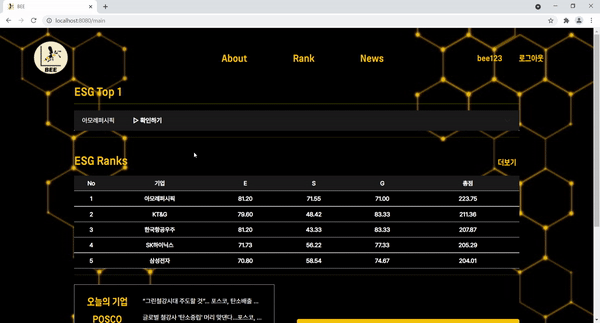
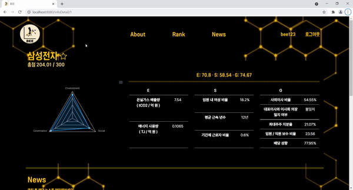
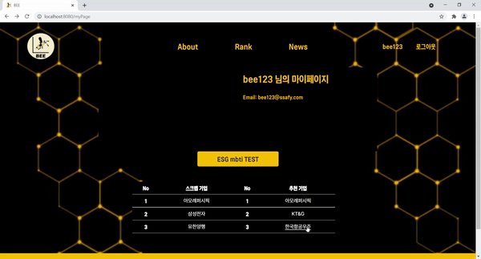
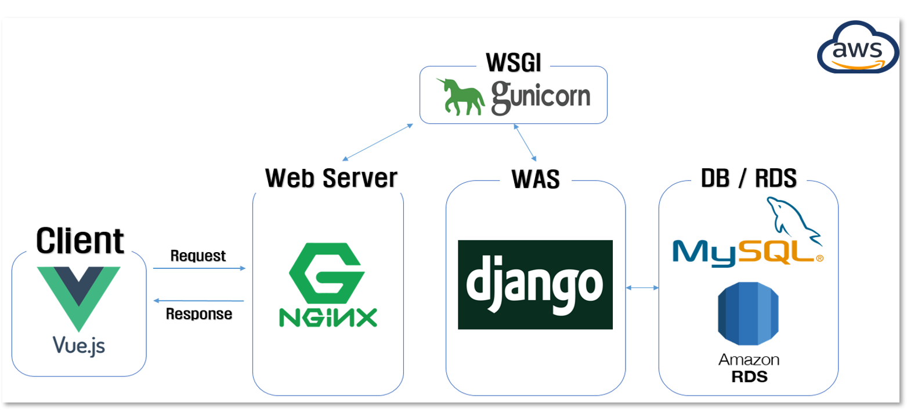
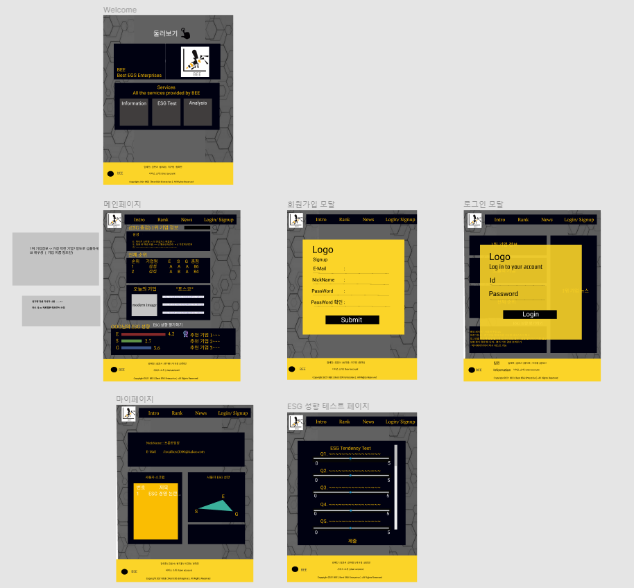
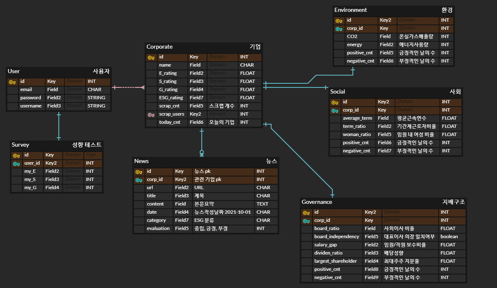
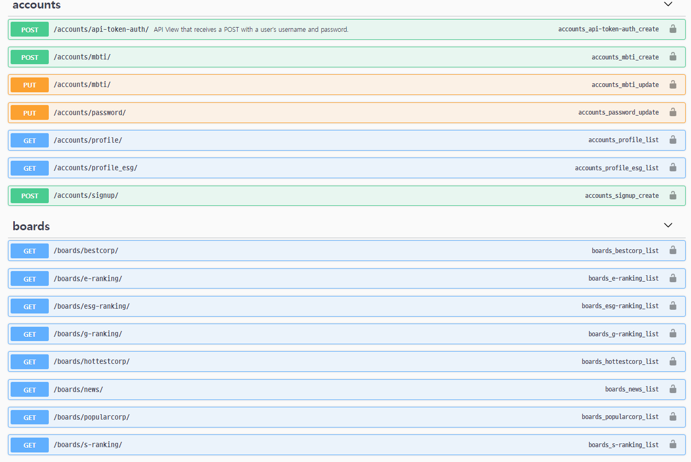

# 🐝BEE

> Best ESG Enterprises
>
> 개발 기간 : 8/30 ~ 10/8 (6주)
>
> 배포 주소: https://www.besg.shop/


## 📒목차

- [기획 의도](#🎡기획-의도)
- [서비스 소개](#👀서비스-소개)
- [개발 스택](#💻개발-스택)
- [서비스구조](#🔗서비스-구조)
- [Getting Started](#⚙-getting-started)
- [프로젝트 기획](#📃프로젝트-기획)
  - [데이터 수집](#🏸데이터-수집-경로)
  - [Design](#🎨design)
  - [ERD 설계](#📝erd-설계)
  - [API 설계](#✒api-설계)
- [프로젝트 규칙](#🤝협업-규칙)
- [팀원 소개](#😀팀원-소개])


## 🎡기획 의도

#### 🖼기획 배경

- 동학 개미운동이라는 단어가 등장할 정도로 투자에 대한 관심도가 높아진 지금, 기업을 평가하는 새로운 기준인 **ESG**가 등장하게 되었습니다.

- **ESG 경영**이란 **'Environment', 'Social', 'Governance'**의 앞 글자를 따서 만들어진 단어로 기업이 **친환경, 사회적 책임, 지배구조 개선** 등을 고려해야 지속 가능한 경영을 할 수 있다는 의미입니다.

- ESG는 이러한 환경, 사회, 지배구조 관련 이슈뿐만 아니라 기업의 재무성과 **지속 가능성**에 영향을 미칠 수 있는 모든 **비재무적 요인**들을 포함합니다.

- 그러나, 현재는 ESG에 대한 명확한 기준이 정해져 있지 않아 제대로 된 판단을 하기 어렵습니다.

**BEE**는 불안정한 ESG 평가 지표를 견고히 함으로써 추후 가치 평가에 대한 새로운 패러다임을 제시하고자 합니다.


#### ✨이런 분들에게 추천합니다.

- 투자에 관심이 있지만, 정보에 대한 확신이 없는 개미 투자자
- 디지털에 대한 수용력이 높은 MZ 세대 
- 합리적 투자를 추구하는 투자자
- 책임 투자, 지속가능경영의 가치를 인지하는 투자자
- 투자 시 기업의 재무적 정보 외에도 비재무적 정보에도 관심이 있는 사람


## 👀서비스 소개

> 소개 영상 : [UCC](./서울_3반_A302_UCC경진대회.mp4)
>
> 사용 설명서: [서비스 시나리오](./exec/시연시나리오.md)

#### 미리보기

- Main + Rank

  

- Detail

  

- ESG MBTI

  


## 💻개발 스택

#### FE

- Vue.js, vue-cli, vue-router, Bootstrap, Apexcharts.js

#### BE


- Django REST API, JWT, Swagger, MySQL(AWS RDS), [KoBERT](https://github.com/SKTBrain/KoBERT)

#### 배포

- AWS EC2, Nginx, gunicorn

#### 협업툴

- JIRA(일정 관리), Gitlab(코드 관리), Notion(내용 정리)
- Discord, Webex (팀미팅)


## 🔗서비스 구조




## ⚙ Getting Started

> 프로젝트 환경설정

#### Backend (Django)

```bash
# 가상환경 생성
$ python -m venv venv
# 가상환경 활성화
$ source venv/Scripts/activate
# KoBERT 관련 설치
$ pip install mxnet
$ pip install git+https://git@github.com/SKTBrain/KoBERT.git@master
# requirements 설치
$ pip install -r requirements.txt
# migrations
$ python manage.py migrate
# 실행
$ python manage.py runserver
```

#### Frontend (Vue.js)

```bash
# 라이브러리 설치
$ yarn install
# vuejs 실행
$ yarn serve
```

#### Server

> [배포문서 참고](./exec/배포스크립트.md)


## 📃프로젝트 기획

> [기능명세서](./Design/특화기능명세서.xlsx)

### 🏸데이터 수집 경로

> [데이터](./Data)

- **환경(E)**
  - [온실가스종합정보센터](http://www.gir.go.kr/home/main.do)
- **사회(S), 지배구조(G)**
  - [OpenDART](https://opendart.fss.or.kr/)
- **뉴스 기사**
  - [네이버 뉴스 검색 API](https://developers.naver.com/docs/serviceapi/search/news/news.md#%EB%89%B4%EC%8A%A4)


### 🎨Design

> [Wireframe](./Design/UI/wireframe.pdf)
>
> [Figma](./Design/UI/prototype.pdf)




### 📝ERD 설계

> [ERDCloud](https://www.erdcloud.com/d/tMztBqeYp7RCeeWSp)




### ✒API 설계

> RESTful API 문서화 + Swagger를 통한 확인
>
> [API 문서](./Design/api문서.md)




## 🤝프로젝트 규칙

### 시간 ⏱️

- Core time
  - 오전 : 10:00~ 11:50
  - 오후 : 13:20 ~ 18:00
- Meeting
  - 주간 : 월요일 30분 - 방향에 관한
  - 일간 (스크럼 회의) : 이슈 공유 등
    - 오전 반 별 미팅 종료 10분 후
    - 오후 17시 50분

### GIT

- 기본
  - 머지 진행 시 **단톡방에 메세지** 남겨주세요.
  - 머지 이전, 상위 브랜치 Pull  해주세요.
  - 머지 이후, 브랜치 삭제 후 새로 생성하여 주세요.
  - master와 develop 머지는 **매주 금요일 저녁 6시** 진행.


- 브랜치 이름
  - Master
  - Develop
    - feature (개별 작업 공간)
      - ex) login


- 브랜치 작업 절차

  - 생성

    ```bash
    $ git branch <branch name>
    ```

  - 이동

    ```bash
    $ git switch <branch name>
    # 또는
    $ git checkout <branch name>
    ```

  - 개별작업 : 각 팀원 로컬에서 작업 수행

  - Merge

    - branch에서 커밋

      ```bash
      $ git add <file name>
      
      $ git commit -m <commit message>
      ```

    - HEAD 변환

      ```bash
      $ git switch <branch name> ; ex) develop 상위 브랜치
      ```

    - 병합

      ```bash
      $ git merge <branch name> ; 이때 브랜치 이름은 작업 후 커밋한 브랜치 이름임
      ```

    - 원격저장소에 올리기

      ```bash
      $ git push origin <branch name> : 이때 브랜치 이름은 머지를 진행한 브랜치임
      ```

      

  - 삭제

    ```bash
    $ git branch -d <branch name> : 삭제할 브랜치 이름
    ```

    - 머지 이후에 브랜치를 삭제하고 다시 만들어 진행할 것
      - 프로젝트 진행 시 문제가 많이 발생하는 이유 중 하나.
      - 브랜치 최신화를 위해 새로 만드는 것이 가장 간편함


- Commit Message

  ```bash
  $ git commit -m {FIX|CLEANUP|FEATURE|DOC}: {MESSAGE}
  ```

  - 대분류

    - FIX : 버그 수정
    - CLEANUP : 코드 정리, 주석 정리(리팩토링)
    - FEATURE : 기능 구현
    - DOC : 문서 작업
    - 더 필요한 것은 추가 (ENHANCE)

    

### JIRA

- 이슈 생성 규칙

  - Epic (큰틀) : 큰 기능? 페이지?

    - story (이야기) : 개발 관련
      - sub task (부작업)
    - task (작업) : 개발 외 작업 ex) 기획 / 설계 / 산출물 등등
      - sub task (부작업)

  - 스토리 포인트 : 해당 이슈의 완료까지 예상 소요 시간

    - 1인당 한 주에 40 시간 이상
    - 1일 - 8시간 작업

  - 스프린트 : 주차별 작업 내용 (도합 스토리 포인트 40시간 이상)

    - 매주 월요일 오전 주간회의 시작
    - 매주 금요일 오후 종료

  - 담당자

    각 작업 담당 인원

    - 팀원 전체 참여 작업은 팀장으로 대체 ex) 브레인 스토밍


- 업데이트
  - 매일 저녁 스크럼 회의 이후 개별 업데이트
    - 커멘트 달기 등등


## 😀팀원 소개

> 담당 역할, 기술

#### 이규정 (Leader)

- G 데이터 수집 및 분석

- Backend
- API 문서 작성
- Frontend 배포

#### 김윤서

- S 데이터 수집 및 분석
- Frontend
- 컴포넌트 구조 설계
- mbti 기능 구현

#### 김예찬

- S 데이터 수집 및 분석
- Frontend
- mbti 기능 구현

- Backend 배포

#### 방지환

- G 데이터 수집 및 분석

- Backend, Swagger 적용
- KoBERT 분류 모델 학습
- 뉴스 기사 텍스트 분석 및 일 단위 뉴스 DB 업데이트 구현

#### 정희진

- E 데이터 수집 및 분석
- Backend
- 유사도 분석을 통한 추천 알고리즘(Cosine Similarity + Euclidean Distance) 및 DB 업데이트 구현
- UCC 제작
