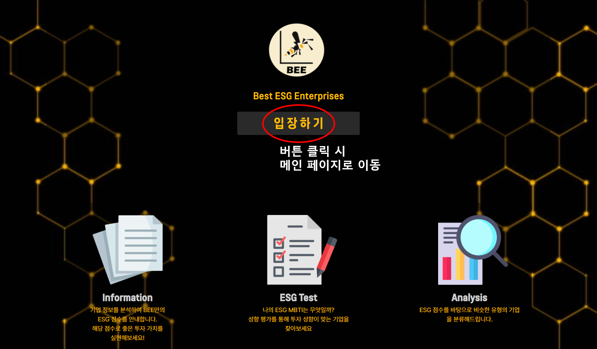

# 시연시나리오

## 📒목차

- [1. Welcome](#1.Welcome)
- [2. Main](#2.메인페이지)
- [3. 회원가입/로그인](#3.회원가입/로그인)
- [4. About](#4.About)
- [5.Rank](#5.Rank)
- [6.Detail](#6.Detail)
- [7.News](#7.News)

- [8.MyPage](#8.MyPage)

## 1.Welcome

- Welcome 페이지에서 제공하는 서비스 정보 확인
- 입장하기 버튼 클릭시 [메인 페이지](#2.메인페이지)로 이동

## 2.메인페이지

1. ESG 1위 기업 정보 제공
   - 클릭 시 상세 정보 확인 가능

2. ESG 상위 5개 기업 정보 확인

   - 더보기 클릭 시 [Rank](#5.Rank) 페이지로 이동
   - 기업 명 클릭시 해당 기업 [Detail](#6.Detail) 페이지로 이동

3. 일별 ESG 관련 언급이 가장 많은 오늘의 기업 정보 확인

   - 회사 정보 확인 클릭 시 해당 기업의 [Detail](#6.Detail) 페이지로 이동
   - 뉴스 기사 클릭 시 뉴스기사로 이동

4. ESG 성향 테스트로 유저 맞춤 추천 서비스 제공

   - 로그인 후 ESG mbti 성향 테스트 진행 가능

   

   - 테스트 이후 ESG 점수 확인

5. 상단의 Navbar에서 메인페이지 / About / Rank / News / 로그인, 로그아웃 / 마이페이지 이동
   - 왼쪽의 로고 누르면 [메인페이지](#2.메인페이지)

## 3.회원가입/로그인

- 회원가입

  

  - Email, 닉네임, Password 입력 후 간단하게 회원가입 진행

- 로그인

  

  - Email, Password 입력 후 로그인

## 4.About

- 서비스 소개 / ESG란 무엇인지? / BEE에서 ESG 평가하는 기준 확인

## 5.Rank

1. E/S/G 전체 순위 확인 가능
   - 기업 클릭시 [Detail](#6.Detail)
2. 검색을 통해 기업 [Detail](#6.Detail) 확인
3. 필터링 기능을 통해 E/S/G/ESG 순으로 정렬
4. 전체 기업의 E/S/G 평균 점수 확인
5. 스크랩이 가장 많이 된 상위 기업 3개 기업 확인
   - 기업명 클릭시 [Detail](#6.Detail)로

## 6.Detail

1. 기업별 E,S,G 관련 데이터 및 그래프 확인
2. 관심 기업 스크랩 기능
   - 마이페이지에서 확인 가능
3. ESG 관련 뉴스 확인
   - 클릭시 뉴스기사로 이동
4. 유사 기업 확인
   - ESG 데이터 기반으로 현재 기업과 유사 기업 추천

## 7.News

- 가장 최근에 업데이트 된 KOSPI 200 기업들의 ESG 관련 뉴스 200개 확인
  - 점수 반영 이후 각 기업별로 10개씩만 DB에 저장되어 있음

## 8.MyPage

1. ESG mbti 평가 결과 그래프로 확인
2. ESG 테스트
   - 결과가 있어도 다시 테스트 가능
3. 본인이 스크랩 한 기업 확인
4. ESG 테스트 결과 기반 기업 추천
   - 평가 결과가 없으면 총점 상위 3개의 기업 추천

